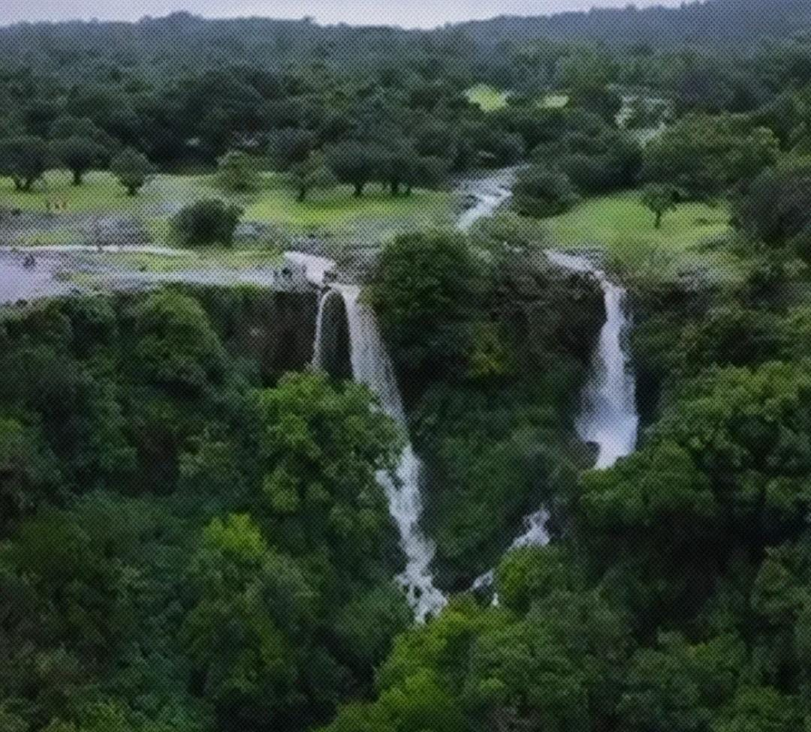

# 🌿 Parwad Village



## 🏡 About Parwad Village

**Parwad Village** is a simple informational website created to showcase **Parwad**, a village in **Khanapur Taluka, Belagavi District, Karnataka, India**.

The website is designed to provide visitors with a simple and attractive introduction to the village, including its local culture, places of interest, festivals, temples, and natural beauty.

The project is built using **HTML, CSS, and JavaScript** and is suitable for deployment using **GitHub Pages**.

---

## ✨ Features

* 🏡 Introduction to Parwad Village
* 🌿 Information about the village
* 🛕 Temple section
* 🌊 Waterfall / natural attractions section
* 🎉 Local festival information
* 📱 Responsive website design
* 🖼️ Image-based village showcase
* 🚀 Easy deployment using GitHub Pages

---

## 🛠️ Technologies Used

| Technology   | Purpose                       |
| ------------ | ----------------------------- |
| HTML5        | Website structure             |
| CSS3         | Styling and responsive design |
| JavaScript   | Interactive functionality     |
| Git & GitHub | Version control and hosting   |
| GitHub Pages | Website deployment            |

---

## 📂 Project Structure

```text
parwadvillage/
│
├── .github/
│   └── workflows/
│
├── index.html
├── fastival.png
├── temple.png
├── waterfall.png
└── README.md
```

---

## 🚀 Run Locally

### 1. Clone the repository

```bash
git clone https://github.com/mayurshivajigawade/parwadvillage.git
```

### 2. Open the project

```bash
cd parwadvillage
```

### 3. Run the website

You can simply open:

```text
index.html
```

in your browser.

Alternatively, if you use VS Code, install **Live Server** and open the project using Live Server.

---

## 🌐 GitHub Pages Deployment

This project can be hosted using GitHub Pages.

### Steps

1. Open the repository on GitHub.
2. Go to **Settings**.
3. Select **Pages**.
4. Under **Build and deployment**, select:

   * Source: `GitHub Actions` or `Deploy from a branch`
5. Select the `main` branch.
6. Save the settings.
7. GitHub will generate a public website URL.

---

## 📸 Website Sections

### 🎉 Festival

The website showcases local festivals and cultural activities of Parwad Village.

### 🛕 Temple

A dedicated section highlights the temple and religious importance of the village.

### 🌊 Waterfall

The website also showcases the natural beauty and waterfall around the village.

---

## 🎯 Project Purpose

The main goal of this project is to create a **digital presence for Parwad Village** and make basic information about the village easily accessible online.

The project can be expanded in the future with:

* 📍 Village location and Google Maps
* 🏫 Schools and educational institutions
* 🏥 Hospitals and healthcare facilities
* 🏛️ Gram Panchayat information
* 📞 Important contact numbers
* 🚌 Transportation information
* 🌾 Agriculture information
* 📰 Village news and announcements
* 📅 Events and festivals
* 🖼️ Village photo gallery
* 🗺️ Interactive village map
* 🌦️ Weather information
* 👥 Important village services

---

## 🔮 Future Improvements

Some planned improvements include:

* [ ] Add responsive mobile navigation
* [ ] Add village history
* [ ] Add Google Maps integration
* [ ] Add photo gallery
* [ ] Add contact section
* [ ] Add Gram Panchayat information
* [ ] Add village announcements
* [ ] Add multilingual support
* [ ] Improve accessibility
* [ ] Add SEO optimization
* [ ] Add backend/database support

---

## 🤝 Contributing

Contributions and suggestions are welcome.

To contribute:

```bash
git clone https://github.com/mayurshivajigawade/parwadvillage.git
cd parwadvillage
```

Create a new branch:

```bash
git checkout -b feature/new-feature
```

Make your changes, commit them, and push:

```bash
git add .
git commit -m "Add new feature"
git push origin feature/new-feature
```

Then create a Pull Request on GitHub.

---

## 👨‍💻 Author

**Mayur Shivaji Gawade**

GitHub:
https://github.com/mayurshivajigawade

---

## 📄 License

This project is available for educational and community purposes.

You may modify and improve the project according to your requirements.

---

## ❤️ Made for Parwad Village

> **Preserving our village. Showcasing our culture. Connecting our community.**

🌿 **Parwad Village — Our Home, Our Heritage.**
